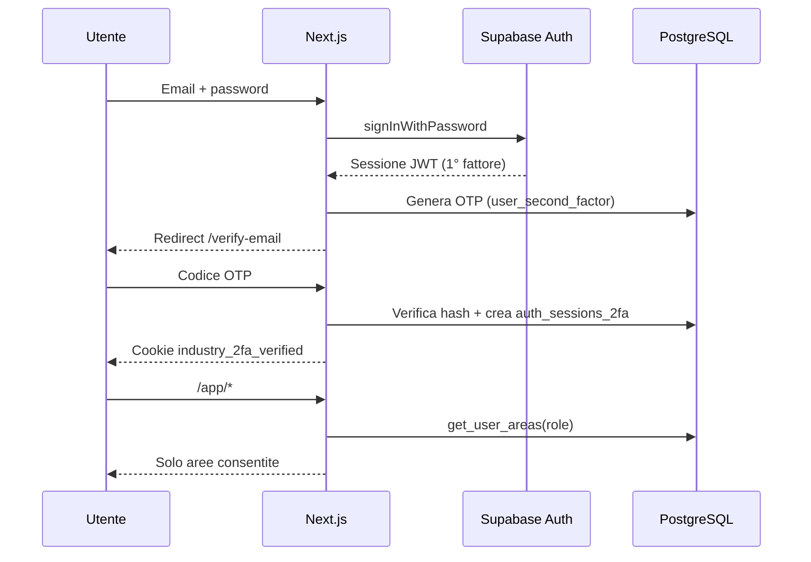

# Architettura — Industry Gestionale

## Panoramica

Applicazione web **Next.js (App Router)** con backend **Supabase** (PostgreSQL + Auth + RLS).

| Livello | Tecnologia |
|---------|------------|
| Frontend | Next.js 15, React 19, Tailwind CSS 4 |
| Auth | Supabase Auth (email/password) |
| 2° fattore (fase 1) | OTP via email |
| 2° fattore (fase 2, futuro) | TOTP app (`user_second_factor.method = 'app'`) |
| Autorizzazione | Ruoli → permessi per area (RLS + controllo server) |

## Flusso di accesso



## Modello dati (Supabase)

- **app_roles** — ruoli applicativi (`admin`, `manager`, `operator`, `viewer`)
- **areas** — moduli del gestionale (slug univoco per URL)
- **role_area_permissions** — matrice ruolo × area
- **profiles** — estensione di `auth.users` con `role_id`
- **user_second_factor** — OTP email o (futuro) secret TOTP
- **auth_sessions_2fa** — sessioni completate dopo verifica email

Funzione SQL **`get_user_areas(user_id)`** restituisce le aree visibili in base al ruolo.

## Struttura cartelle

```
src/
├── app/
│   ├── actions/auth.ts      # login, OTP, logout
│   ├── app/                 # area protetta (post-2FA)
│   ├── login/
│   ├── verify-email/
│   └── auth/callback/
├── components/
│   ├── auth/
│   ├── layout/
│   └── areas/
├── lib/
│   ├── auth/
│   ├── areas/
│   └── supabase/
├── types/database.ts
└── middleware.ts            # redirect login / 2FA
supabase/migrations/         # schema SQL
```

## Ruoli e aree (seed)

| Ruolo | Aree tipiche |
|-------|----------------|
| admin | Tutte, incluse impostazioni |
| manager | Tutte tranne impostazioni |
| operator | Dashboard, commerciale, produzione, magazzino |
| viewer | Dashboard, commerciale (sola consultazione in fase 2) |

## Estensioni future

1. **Invio email OTP** — Edge Function Supabase o Resend
2. **2FA app** — campo `totp_secret_encrypted`, UI enroll, `method = 'app'`
3. **Permessi CRUD** — colonne `can_create`, `can_update`, `can_delete` su `role_area_permissions`
4. **Moduli business** — tabelle per ordini, magazzino, ecc. per area

## Sicurezza

- RLS attivo su tutte le tabelle pubbliche
- Service role solo in Server Actions (`auth.ts`)
- Cookie 2FA HttpOnly, hash SHA-256 del token in DB
- Middleware blocca `/app/*` senza cookie 2FA valido
